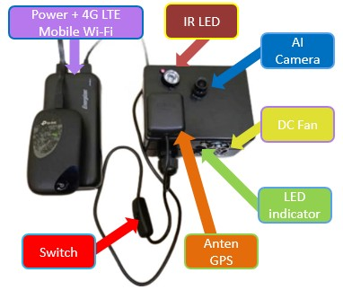
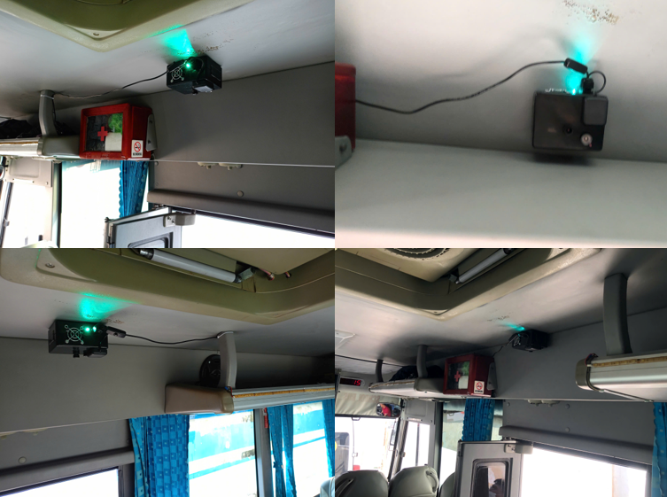
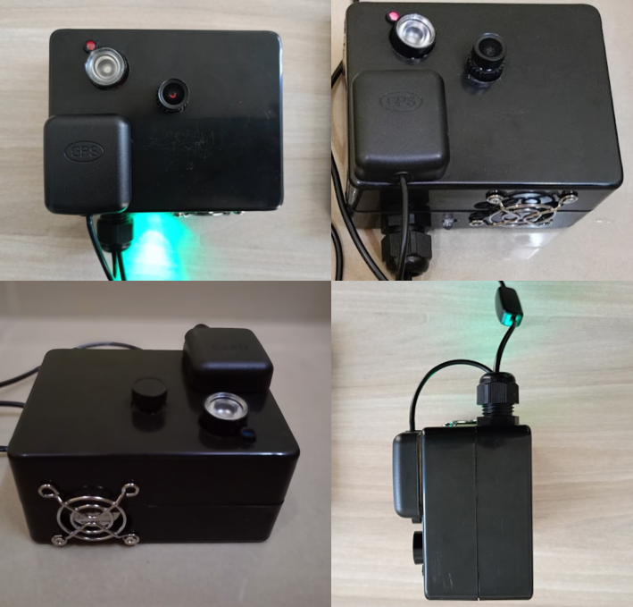
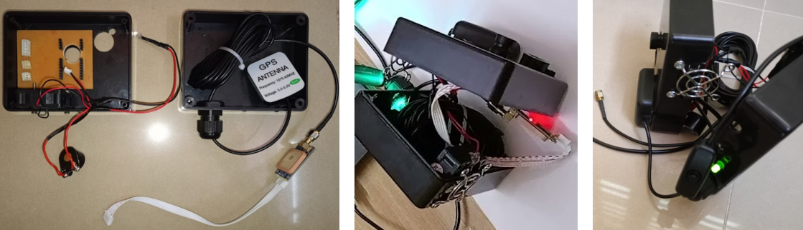
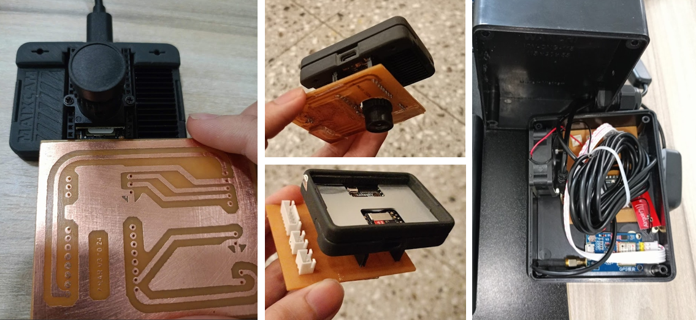
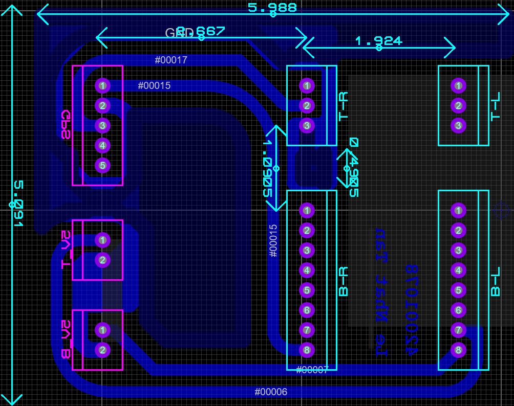
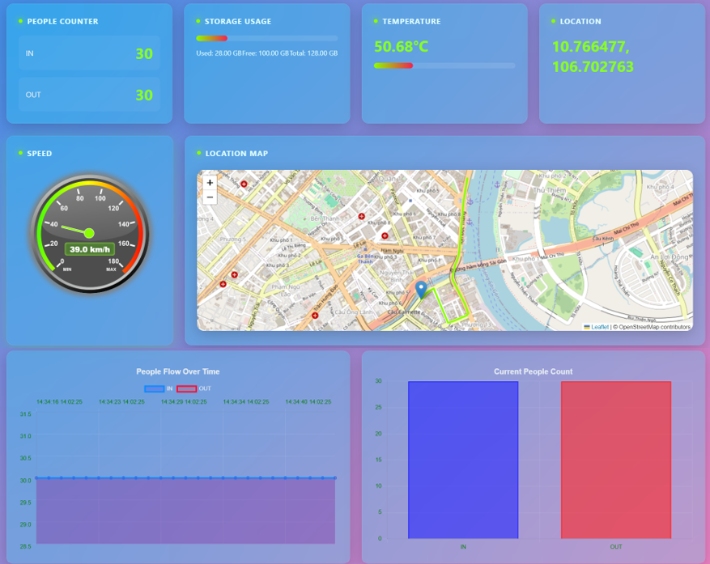

# INTELSCHOOLBUS-THE-SYSTEM-FOR-COUNTING-AND-CONTROLLING-STUDENTS-ON-SCHOOL-BUSES

## Information
This repository contains my graduation project, developed by `Le Nhat Tan` in 2024 as part of the requirements for his Bachelor of Engineering degree in `Electronics and Telecommunications Engineering at Ton Duc Thang University HCMC, Vietnam` (Intake K24, academic year 2020-2024). The project was advised by `Dr. Le Anh Vu`. 

## Abstract
Real-time passenger counting on buses is a crucial task for enhancing monitoring efficiency in transportation, education, and smart city development, aligning with the trends and goals of digital transformation. This project introduces a compact system featuring an AI-powered camera integrated with a GPS module to `monitor and count passengers or students in real time` on buses, addressing safety and operational concerns in public transportation.

Compared to existing research utilizing various methods such as DeepSORT, Kalman Filters, and YOLO variants with hardware like Raspberry Pi and Arduino, this work advances the field by leveraging next-generation hardware based on RISC-V architecture. It incorporates a powerful integrated NPU with an optimized model for embedded systems, combined with essential components to ensure effective and stable operation in real-world conditions.

Specifically, the system employs a YOLO model converted to a lighter format (cvimodel), utilizing a head detection model trained on `10,000 images` in conjunction with ByteTrack tracking. The report also highlights limitations of existing solutions and the optimized features of the proposed system.

The system has been ordered and deployed on buses within The Hong Ngoc – Ruby School Education System (part of the Tri Duc Education System). The results of this project were accepted at The 13th International Conference on Green and Human Information Technology (ICGHIT) is co-hosted by Green and Human Information Technology (GHIT), The Institute of Electronics and Information Engineers (IEIE). Additionally, this project advanced to the Competition Round of the "AI. STAR 2024" contest for innovative AI application projects in Ho Chi Minh City, organized by the Department of Science and Technology of Ho Chi Minh City, with SIHUB serving as the implementing unit.

## Introduction
This project aims to develop an integrated system for real-time student counting on school buses. The project begins by researching lightweight recognition, tracking, and counting models that are affordable  but operate effectively on low-cost devices, under $150. The system must be able to access data outside the LAN, ensuring seamless IoT connectivity for remote monitoring and data access. Additionally, the project will explore `GPS` systems and their integration with mapping APIs, enabling `tracking the bus's location` with an error margin of less than 5 meters and monitoring the number of students in real-time via a web interface with a database for storing information. The system also ensures the integration of power source and embedded hardware with `custom dataset trained lightweight AI model` allowing continuous operation across three school shifts: morning, noon, and afternoon, equating to `12 hours`; dimensions not exceeding 200x200x100 mm to easy installation on school buses. Throughout the product development process, the project will analyze and evaluate both `hardware and software` results in ensure optimal performance and reliability. 

Finally, the project will produce [report](https://github.com/nhattan86/INTELSCHOOLBUS-THE-SYSTEM-FOR-COUNTING-AND-CONTROLLING-STUDENTS-ON-SCHOOL-BUSES/blob/main/42001078_LeNhatTan.pdf), [presentation](https://github.com/nhattan86/INTELSCHOOLBUS-THE-SYSTEM-FOR-COUNTING-AND-CONTROLLING-STUDENTS-ON-SCHOOL-BUSES/blob/main/42001078_LeNhatTan_slides_DATN.pdf), and [poster](https://github.com/nhattan86/INTELSCHOOLBUS-THE-SYSTEM-FOR-COUNTING-AND-CONTROLLING-STUDENTS-ON-SCHOOL-BUSES/blob/main/42001078_L%C3%AA%20Nh%E1%BA%ADt%20T%C3%A2n_poster.png). The system's performance requirements are to achieve a frame rate above 10 FPS and an accuracy greater than 95%, with potential for further improvement. Table 1 shows the performance and hardware specifications of the Intelschoolbus – the system for counting and controlling students on school buses. 

*Table 1: The completed product*
| Property                        | The completed product          | Required Specification                |
|---------------------------------|-------------------------------|---------------------------------------|
| Accuracy                        | 96%                           | Over 95%                               |
| FPS (Frames per Second)         | Over 10                       | Over 10                               |
| Cost                            | $108                          | Below $150                             |
| Weight                          | 150 grams                     | Below 200 grams                        |
| Average operating temperature measured | Below 50°C                    | Below 80°C                             |
| Operating Time                  | 12 hours continuously         | Minimum 12 hours continuously          |
| System Size                     | 115x90x55 mm                 | Smaller than 200x200x100 mm            |
| Other Standards                 | Industrial-grade wired connection, dustproof, and water-resistant IPX22 | Industrial-grade wired connection, dustproof, and water-resistant IPX22 |

Figure 1 provides a detailed description of the components in the system used in conjunction, it is a block with size `115x90x55 mm` contains camera, module GPS and antenas, with LED indicator, IR LED and DC fan for drawing hot air from the inside out for cooling. The system, after careful consideration, has been selected for installation at the entrance of the bus, assuming the bus has only one door for passengers. Figure 2 shows the system and its position. In that position, the camera captures a comprehensive view of passengers’ heads and a wide area of movement, enabling effective tracking and inference of the passengers’ movement direction.

*Figure 1: Detailed description of the components in the system*

*Figure 2: The system deployed on the bus*

Figure 3 provides a comprehensive view of the product's exterior, highlighting two ventilation holes, while also offering a detailed depiction of the internal layout of the system. The internal components are securely arranged and fixed using PU Tape made from acrylic material and the latest Nano gel technology. This adhesive is safe, non-toxic, and provides strong bonding. 

*Figure 3: System appearance details*

Additionally, Figure 4 & 5 showcases the precise design of the PCB layout (designed by [Proteus](https://github.com/nhattan86/INTELSCHOOLBUS-THE-SYSTEM-FOR-COUNTING-AND-CONTROLLING-STUDENTS-ON-SCHOOL-BUSES/blob/main/42001078_LeNhatTan_PCB.pdsprj) as Figure 6), ensuring a perfect fit with the camera's lens and maintaining an optimal distance between the headers.

*Figure 4: System interior details*

*Figure 5: PCB Circuit connected to camera*

*Figure 6: PCB layout*

When the transmitter side (system deployed on bus) operates, it will send data in the form of packaged JSON. On the receiving side, the web application running on Flask will receive this data and display it with the interface shown in Figure 7. The protocol used for transmitter is MQTT, sending to a public IP address of AWS, so all users outside the LAN network can view the data.

*Figure 7: Web application for monitoring*

## Acknowledgment
First and foremost, I would like to extend my deepest gratitude to my undergraduate thesis advisor, Dr. Le Anh Vu. Throughout the process of completing my thesis, I encountered many questions and uncertainties, all of which were met with his patient and enthusiastic guidance. He not only clarified my doubts but also imparted valuable knowledge related to my research topic. I am sincerely thankful for the time and effort he dedicated to helping me understand complex concepts. His passionate mentorship and clear direction played a crucial role in enabling me to successfully complete this significant and meaningful thesis. It is a deeply humane and purposeful project, one I have always aspired to undertake, and I feel incredibly fortunate that he helped me seize this opportunity.  

I would also like to express my appreciation to all the faculty members of the Department of Electrical and Electronics Engineering. The foundational knowledge they imparted has equipped me with the understanding needed to pursue advanced research and undertake meaningful projects like this one.  Additionally, I am grateful to Mr. Nghia and Mr. Dung, senior peers who generously supported me throughout the process. My special thanks also go to Mr. Tien, Vice Principal of Ruby Hong Ngoc Primary and Secondary School, for providing the necessary support and permissions that allowed me to deploy my system on the school bus. During the system testing phase, Mr. Tri, the school bus driver, offered invaluable assistance with great enthusiasm and I am sincerely thankful for his kindness and cooperation.

Every form of assistance I received from Dr. Le Anh Vu, the faculty members, and my peers is something I will always cherish and hold dear. Once again, I sincerely thank Dr. Le Anh Vu for accepting me as his student and guiding me through my undergraduate thesis with such dedication and care.

